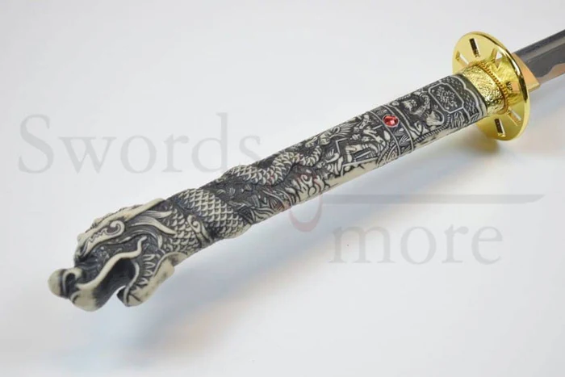
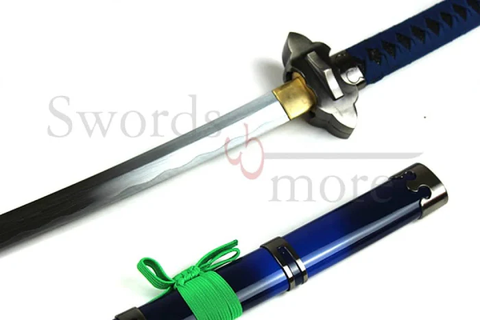
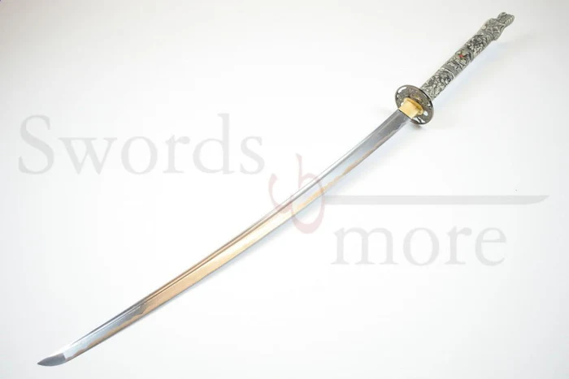

# Cosas por realizar
1. Falta la seccion de afilar en servicios, añadir dos secciones en contacto, realizar la pagina adicional
2. En el readme añadir detalles que se vean convenientes

## Ideas 
- Para la pagina adicional las secciones dividirlas en por ejemplo primero un carrusel de fotos,
una promocion y repetir la opcion de clientes o pensar en otra

- Para la pagina de contacto añadir por ejemplo seccion e informacion de la empresa y en 
la otra

# Instrucciones del proyecto

## Descripción
**Bushido Blades** es un proyecto web dedicado a ofrecer una experiencia única para los entusiastas de las katanas y la cultura samurái. 
A través de una plataforma visualmente atractiva y fácil de navegar, el sitio web proporciona información sobre los servicios que ofrece la tienda, 
que van desde la personalización y el mantenimiento de katanas hasta clases de Kenjutsu, el arte tradicional de combate con katana.

### Características Principales

- **Personalización de Katanas**: Los usuarios pueden acceder a un servicio de personalización, donde tienen la oportunidad de crear una katana única que se ajuste a su estilo y necesidades personales.

- **Mantenimiento y Afilado**: Ofrecemos servicios de mantenimiento y afilado para garantizar que las katanas estén en óptimas condiciones, listos para su uso en cualquier momento.

- **Clases de Kenjutsu**: Bushido Blades también organiza clases de Kenjutsu, adecuadas para todos los niveles de habilidad. 
Los instructores son expertos en el arte del combate samurái y brindan formación tanto para principiantes como para avanzados.

### Estructura del Proyecto

El sitio está construido con **HTML5**, **CSS** y utiliza **buena semántica** para asegurar una estructura limpia y fácil de mantener. La web está diseñada para ser completamente funcional en diferentes dispositivos, con un enfoque en la accesibilidad y la experiencia del usuario.

### Objetivos del Proyecto

El principal objetivo de **Bushido Blades** es ofrecer una plataforma en línea eficiente, profesional y elegante donde los clientes puedan explorar y acceder a servicios relacionados con las katanas. Además, se busca crear una comunidad alrededor de la cultura samurái a través de la educación en Kenjutsu y la atención al detalle en cada katana personalizada.

## Instrucciones para visualización

1. Para poder visualizar el proyecto primero deberemos tener acceso al repositorio
2. Una vez con acceso al repositorio podemos tanto clonarlo como descargar los archivos
3. Si hemos decidido clonar lo que haremos sera iniciar el repositorio con el IDE que usemos
4. En caso de haber descargado los archivos lo que tendremos que hacer es abrir nuestro IDE y cargar los archivos dentro de este
5. Una vez hecho esto ya podremos iniciar el proyecto para poder visualizarlo

## Detalles

- He hecho uso de la etiqueta div en esta ocasion debido 
a que es la que mas se ajusta a lo quiero representar 
ya que seria menos eficiente hacerlo con alguna otra etiqueta

```html
    <section class="servicios__kenjutsu">
        
        <div class="kenjutsu__texto">
            <h2 class="kenjutsu__titulo">Clases de Kenjutsu</h2>
            <p class="kenjutsu__descripcion">
                Clases de Kenjutsu: Domina el Arte del Combate con Katana
                En Bushido Blades, ofrecemos clases de Kenjutsu, el arte tradicional del combate con katana, impartidas por maestros experimentados.
                Nuestras sesiones están diseñadas para todos los niveles, desde principiantes que desean aprender los fundamentos
                hasta practicantes avanzados que buscan perfeccionar su técnica.
            </p>
        </div>
    </section>
```

- He tenido que usar la etiqueta div para poder crear un carrusel de imágenes debido a que de otra forma no quedaba bien hecho

```html
    <!-- Contenedor de imágenes -->
    <div class="carrusel-contenedor">
        <div class="carrusel-imagen">
            
        </div>
        <div class="carrusel-imagen">
            
        </div>
        <div class="carrusel-imagen">
            
        </div>
        <div class="carrusel-imagen">
            
        </div>
    </div>
```